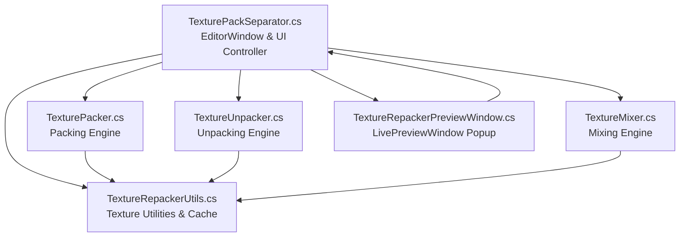

# Design Specification: Texture Repacker Refactoring

**Date**: 2026-06-12  
**Feature**: Texture Repacker  
**Status**: Approved  

## Overview
The `TexturePackSeparator.cs` file is currently a single-file implementation (~1,300 lines of C#) containing both the Unity Editor GUI structure (using UI Toolkit) and the core texture processing algorithms (packing channels, unpacking channels, and blending/mixing textures). 

This design doc outlines the plan to refactor this tool into separate, modular components with single responsibilities. This will improve code readability, simplify maintenance, and enable the reuse/testing of individual texture processing operations independently of the Editor GUI.

## Proposed Architecture

All new files will be created in the `p:\Personal\00 Unity\03 RexTools\RexTools\RexTools-Unity6\Editor\Texture Repacker\` directory and will share the `RexTools.TextureRepacker.Editor` namespace.



### 1. `TextureRepackerUtils.cs` (Shared Utilities)
Handles texture pixel reading, cache management, and naming helpers.
```csharp
namespace RexTools.TextureRepacker.Editor
{
    public static class TextureRepackerUtils
    {
        // Cache mapping texture InstanceID to pixel colors array
        private static readonly System.Collections.Generic.Dictionary<int, UnityEngine.Color[]> PixelCache = 
            new System.Collections.Generic.Dictionary<int, UnityEngine.Color[]>();

        public static void ClearCache() => PixelCache.Clear();
        public static void RemoveFromCache(int instanceID) => PixelCache.Remove(instanceID);

        public static UnityEngine.Color[] GetReadablePixels(UnityEngine.Texture2D tex)
        {
            int id = tex.GetInstanceID();
            if (PixelCache.TryGetValue(id, out var cached)) return cached;

            UnityEngine.Color[] pixels;
            if (tex.isReadable)
            {
                pixels = tex.GetPixels();
            }
            else
            {
                var copy = MakeReadableCopy(tex);
                pixels = copy.GetPixels();
                UnityEngine.Object.DestroyImmediate(copy);
            }
            PixelCache[id] = pixels;
            return pixels;
        }

        public static UnityEngine.Texture2D MakeReadableCopy(UnityEngine.Texture2D tex)
        {
            var tmp = UnityEngine.RenderTexture.GetTemporary(tex.width, tex.height, 0, UnityEngine.RenderTextureFormat.ARGB32);
            UnityEngine.Graphics.Blit(tex, tmp);
            var prev = UnityEngine.RenderTexture.active;
            UnityEngine.RenderTexture.active = tmp;
            var readable = new UnityEngine.Texture2D(tex.width, tex.height, UnityEngine.TextureFormat.RGBA32, false);
            readable.ReadPixels(new UnityEngine.Rect(0, 0, tex.width, tex.height), 0, 0);
            readable.Apply();
            UnityEngine.RenderTexture.active = prev;
            UnityEngine.RenderTexture.ReleaseTemporary(tmp);
            return readable;
        }

        public static string GenerateBaseName(string name)
        {
            string[] suffixes = { "_packed", "_pack", "_combined", "_tex", "_diffuse", "_albedo" };
            foreach (var s in suffixes)
            {
                if (name.EndsWith(s, System.StringComparison.OrdinalIgnoreCase))
                    name = name.Substring(0, name.Length - s.Length);
            }
            return name.TrimEnd('_', '-', ' ');
        }
    }
}
```

### 2. `TexturePacker.cs` (Pack Engine)
Encapsulates slot models and the pixel composition algorithm.
```csharp
namespace RexTools.TextureRepacker.Editor
{
    public class ChannelSlotData
    {
        public UnityEngine.Texture2D texture;
        public int channelIndex = 0; // 0=R, 1=G, 2=B, 3=A
        public bool invert = false;
        public bool useCustom = false;
        public float customValue = 0.5f;
    }

    public static class TexturePacker
    {
        public static UnityEngine.Texture2D Pack(ChannelSlotData[] slots, int width, int height, System.Action<string, float> progressCallback = null)
        {
            var result = new UnityEngine.Texture2D(width, height, UnityEngine.TextureFormat.RGBA32, false);
            var pixels = new UnityEngine.Color[width * height];

            UnityEngine.Color[][] slotPixels = new UnityEngine.Color[4][];
            int[] slotW = new int[4];
            int[] slotH = new int[4];
            float[] customVals = new float[4];

            for (int c = 0; c < 4; c++)
            {
                if (!slots[c].useCustom && slots[c].texture != null)
                {
                    slotPixels[c] = TextureRepackerUtils.GetReadablePixels(slots[c].texture);
                    slotW[c] = slots[c].texture.width;
                    slotH[c] = slots[c].texture.height;
                }
                if (slots[c].useCustom)
                    customVals[c] = slots[c].invert ? 1f - slots[c].customValue : slots[c].customValue;
                else if (slots[c].texture == null)
                    customVals[c] = (c == 3) ? 1f : 0f;
            }

            int progressInterval = UnityEngine.Mathf.Max(1, height / 20);
            for (int y = 0; y < height; y++)
            {
                if (y % progressInterval == 0 && progressCallback != null)
                {
                    progressCallback($"Processing row {y}/{height}...", (float)y / height);
                }

                for (int x = 0; x < width; x++)
                {
                    float[] channels = new float[4];
                    for (int c = 0; c < 4; c++)
                    {
                        if (slots[c].useCustom || slots[c].texture == null)
                        {
                            channels[c] = customVals[c];
                        }
                        else
                        {
                            int srcX = UnityEngine.Mathf.Clamp(x * slotW[c] / width, 0, slotW[c] - 1);
                            int srcY = UnityEngine.Mathf.Clamp(y * slotH[c] / height, 0, slotH[c] - 1);
                            var p = slotPixels[c][srcY * slotW[c] + srcX];
                            float val = slots[c].channelIndex == 0 ? p.r : slots[c].channelIndex == 1 ? p.g : slots[c].channelIndex == 2 ? p.b : p.a;
                            if (slots[c].invert) val = 1f - val;
                            channels[c] = val;
                        }
                    }
                    pixels[y * width + x] = new UnityEngine.Color(channels[0], channels[1], channels[2], channels[3]);
                }
            }

            result.SetPixels(pixels);
            result.Apply();
            return result;
        }

        public static float[] SampleSlotChannel(ChannelSlotData slot, int size)
        {
            float[] result = new float[size * size];

            if (slot.useCustom)
            {
                float val = slot.invert ? 1f - slot.customValue : slot.customValue;
                System.Array.Fill(result, val);
                return result;
            }

            if (slot.texture == null)
            {
                float val = (slot.channelIndex == 3) ? 1f : 0f;
                System.Array.Fill(result, val);
                return result;
            }

            var srcPixels = TextureRepackerUtils.GetReadablePixels(slot.texture);
            int srcW = slot.texture.width;
            int srcH = slot.texture.height;
            int channel = slot.channelIndex;
            bool invert = slot.invert;

            for (int y = 0; y < size; y++)
            {
                int srcY = UnityEngine.Mathf.Clamp(y * srcH / size, 0, srcH - 1);
                for (int x = 0; x < size; x++)
                {
                    int srcX = UnityEngine.Mathf.Clamp(x * srcW / size, 0, srcW - 1);
                    var p = srcPixels[srcY * srcW + srcX];
                    float val = channel == 0 ? p.r : channel == 1 ? p.g : channel == 2 ? p.b : p.a;
                    if (invert) val = 1f - val;
                    result[y * size + x] = val;
                }
            }
            return result;
        }
    }
}
```

### 3. `TextureUnpacker.cs` (Unpack Engine)
```csharp
namespace RexTools.TextureRepacker.Editor
{
    public static class TextureUnpacker
    {
        public static void Unpack(
            UnityEngine.Texture2D source,
            bool[] activeChannels,
            string[] suffixes,
            bool[] invert,
            string outputName,
            string outputPath,
            System.Action<string, float> progressCallback = null)
        {
            var pixels = TextureRepackerUtils.GetReadablePixels(source);
            int w = source.width;
            int h = source.height;

            for (int i = 0; i < 4; i++)
            {
                if (!activeChannels[i]) continue;
                
                if (progressCallback != null)
                {
                    progressCallback($"Extracting channel {i}...", (float)i / 4f);
                }

                var res = new UnityEngine.Texture2D(w, h, UnityEngine.TextureFormat.RGB24, false);
                var resPixels = new UnityEngine.Color[pixels.Length];
                bool inv = invert[i];

                for (int p = 0; p < pixels.Length; p++)
                {
                    float val = i == 0 ? pixels[p].r : i == 1 ? pixels[p].g : i == 2 ? pixels[p].b : pixels[p].a;
                    if (inv) val = 1f - val;
                    resPixels[p] = new UnityEngine.Color(val, val, val, 1f);
                }
                res.SetPixels(resPixels);
                res.Apply();

                string outFilePath = System.IO.Path.Combine(outputPath, outputName + suffixes[i] + ".png").Replace('\\', '/');
                System.IO.File.WriteAllBytes(outFilePath, res.EncodeToPNG());
                UnityEngine.Object.DestroyImmediate(res);
            }
        }

        public static UnityEngine.Texture2D GenerateChannelPreview(UnityEngine.Texture2D source, int channel, bool invert, System.Action<string, float> progressCallback = null)
        {
            int w = source.width;
            int h = source.height;
            var result = new UnityEngine.Texture2D(w, h, UnityEngine.TextureFormat.RGBA32, false);
            var pixels = new UnityEngine.Color[w * h];
            var srcPixels = TextureRepackerUtils.GetReadablePixels(source);

            int progressInterval = UnityEngine.Mathf.Max(1, h / 20);
            for (int y = 0; y < h; y++)
            {
                if (y % progressInterval == 0 && progressCallback != null)
                {
                    progressCallback($"Processing row {y}/{h}...", (float)y / h);
                }
                for (int x = 0; x < w; x++)
                {
                    var p = srcPixels[y * w + x];
                    float val = channel == 0 ? p.r : channel == 1 ? p.g : channel == 2 ? p.b : p.a;
                    if (invert) val = 1f - val;
                    pixels[y * w + x] = new UnityEngine.Color(val, val, val, 1f);
                }
            }

            result.SetPixels(pixels);
            result.Apply();
            return result;
        }
    }
}
```

### 4. `TextureMixer.cs` (Mix/Blend Engine)
```csharp
namespace RexTools.TextureRepacker.Editor
{
    public enum BlendMode
    {
        Multiply, Add, Screen, Overlay, Subtract, Divide, Darken, Lighten, SoftLight, HardLight
    }

    public static class TextureMixer
    {
        public static UnityEngine.Texture2D Mix(
            UnityEngine.Texture2D baseTex,
            UnityEngine.Texture2D layerTex,
            int baseChannel,
            int layerChannel,
            BlendMode blendMode,
            float opacity,
            System.Action<string, float> progressCallback = null)
        {
            int w = baseTex.width;
            int h = baseTex.height;

            var result = new UnityEngine.Texture2D(w, h, UnityEngine.TextureFormat.RGBA32, false);
            var pixels = new UnityEngine.Color[w * h];

            var basePixels = TextureRepackerUtils.GetReadablePixels(baseTex);
            var layerPixels = layerTex != null ? TextureRepackerUtils.GetReadablePixels(layerTex) : null;
            int lW = layerTex != null ? layerTex.width : 1;
            int lH = layerTex != null ? layerTex.height : 1;

            int progressInterval = UnityEngine.Mathf.Max(1, h / 20);
            for (int y = 0; y < h; y++)
            {
                if (y % progressInterval == 0 && progressCallback != null)
                {
                    progressCallback($"Row {y}/{h}", (float)y / h);
                }
                for (int x = 0; x < w; x++)
                {
                    var bc = basePixels[y * w + x];
                    var lc = UnityEngine.Color.black;
                    if (layerPixels != null)
                    {
                        int lx = UnityEngine.Mathf.Clamp(x * lW / w, 0, lW - 1);
                        int ly = UnityEngine.Mathf.Clamp(y * lH / h, 0, lH - 1);
                        lc = layerPixels[ly * lW + lx];
                    }
                    var fb = ApplyChannelSelect(bc, baseChannel);
                    var fl = ApplyChannelSelect(lc, layerChannel);
                    var blended = BlendColors(fb, fl, blendMode);
                    pixels[y * w + x] = UnityEngine.Color.Lerp(fb, blended, opacity);
                }
            }

            result.SetPixels(pixels);
            result.Apply();
            return result;
        }

        public static UnityEngine.Color ApplyChannelSelect(UnityEngine.Color c, int channel)
        {
            if (channel < 0) return c; // Full
            float v = channel == 0 ? c.r : channel == 1 ? c.g : channel == 2 ? c.b : c.a;
            return new UnityEngine.Color(v, v, v, 1f);
        }

        public static UnityEngine.Color BlendColors(UnityEngine.Color b, UnityEngine.Color l, BlendMode mode)
        {
            var result = b;
            switch (mode)
            {
                case BlendMode.Multiply:  result = new UnityEngine.Color(b.r * l.r, b.g * l.g, b.b * l.b, b.a * l.a); break;
                case BlendMode.Add:       result = new UnityEngine.Color(UnityEngine.Mathf.Clamp01(b.r + l.r), UnityEngine.Mathf.Clamp01(b.g + l.g), UnityEngine.Mathf.Clamp01(b.b + l.b), UnityEngine.Mathf.Clamp01(b.a + l.a)); break;
                case BlendMode.Screen:    result = new UnityEngine.Color(1 - (1 - b.r) * (1 - l.r), 1 - (1 - b.g) * (1 - l.g), 1 - (1 - b.b) * (1 - l.b), 1 - (1 - b.a) * (1 - l.a)); break;
                case BlendMode.Subtract:  result = new UnityEngine.Color(UnityEngine.Mathf.Clamp01(b.r - l.r), UnityEngine.Mathf.Clamp01(b.g - l.g), UnityEngine.Mathf.Clamp01(b.b - l.b), UnityEngine.Mathf.Clamp01(b.a - l.a)); break;
                case BlendMode.Divide:    result = new UnityEngine.Color(UnityEngine.Mathf.Clamp01(l.r < 0.001f ? 1f : b.r / l.r), UnityEngine.Mathf.Clamp01(l.g < 0.001f ? 1f : b.g / l.g), UnityEngine.Mathf.Clamp01(l.b < 0.001f ? 1f : b.b / l.b), UnityEngine.Mathf.Clamp01(l.a < 0.001f ? 1f : b.a / l.a)); break;
                case BlendMode.Darken:    result = new UnityEngine.Color(UnityEngine.Mathf.Min(b.r, l.r), UnityEngine.Mathf.Min(b.g, l.g), UnityEngine.Mathf.Min(b.b, l.b), UnityEngine.Mathf.Min(b.a, l.a)); break;
                case BlendMode.Lighten:   result = new UnityEngine.Color(UnityEngine.Mathf.Max(b.r, l.r), UnityEngine.Mathf.Max(b.g, l.g), UnityEngine.Mathf.Max(b.b, l.b), UnityEngine.Mathf.Max(b.a, l.a)); break;
                case BlendMode.Overlay:   result = new UnityEngine.Color(OverlayChannel(b.r, l.r), OverlayChannel(b.g, l.g), OverlayChannel(b.b, l.b), OverlayChannel(b.a, l.a)); break;
                case BlendMode.SoftLight: result = new UnityEngine.Color(SoftLightChannel(b.r, l.r), SoftLightChannel(b.g, l.g), SoftLightChannel(b.b, l.b), SoftLightChannel(b.a, l.a)); break;
                case BlendMode.HardLight: result = new UnityEngine.Color(OverlayChannel(l.r, b.r), OverlayChannel(l.g, b.g), OverlayChannel(l.b, b.b), OverlayChannel(l.a, b.a)); break;
            }
            return result;
        }

        private static float OverlayChannel(float b, float l)
            => b < 0.5f ? 2f * b * l : 1f - 2f * (1f - b) * (1f - l);

        private static float SoftLightChannel(float b, float l)
            => l < 0.5f
                ? b - (1f - 2f * l) * b * (1f - b)
                : b + (2f * l - 1f) * (D(b) - b);

        private static float D(float b) => b <= 0.25f ? ((16f * b - 12f) * b + 4f) * b : UnityEngine.Mathf.Sqrt(b);
    }
}
```

### 5. `TextureRepackerPreviewWindow.cs` (Popup Preview Window)
Extracts the nested `LivePreviewWindow` into its own file.
```csharp
namespace RexTools.TextureRepacker.Editor
{
    public class TextureRepackerPreviewWindow : UnityEditor.EditorWindow
    {
        private UnityEngine.UIElements.Image _image;
        private TexturePackSeparator _owner;
        private int _mode;
        private UnityEngine.Texture2D _highResTexture;
        private UnityEngine.UIElements.Label _resLabel;

        public static void ShowWindow(TexturePackSeparator owner, int mode, string title)
        {
            var window = GetWindow<TextureRepackerPreviewWindow>("Rex Tools - " + title);
            window._owner = owner;
            window._mode = mode;
            window.minSize = new UnityEngine.Vector2(512, 512);
            window.RefreshHighRes();
        }

        private void CreateGUI()
        {
            var toolbar = new UnityEngine.UIElements.VisualElement 
            { 
                style = { flexDirection = UnityEngine.UIElements.FlexDirection.Row, backgroundColor = new UnityEngine.Color(0.2f, 0.2f, 0.2f), paddingLeft = 5, paddingRight = 5, height = 25, alignItems = UnityEngine.UIElements.Align.Center } 
            };
            
            var refreshBtn = new UnityEngine.UIElements.Button { text = "Refresh High-Res", style = { height = 20, fontSize = 10 } };
            refreshBtn.clicked += RefreshHighRes;
            toolbar.Add(refreshBtn);

            _resLabel = new UnityEngine.UIElements.Label("Resolution: -") { style = { marginLeft = 10, fontSize = 10, color = UnityEngine.Color.gray } };
            toolbar.Add(_resLabel);

            rootVisualElement.Add(toolbar);

            _image = new UnityEngine.UIElements.Image { scaleMode = UnityEngine.ScaleMode.ScaleToFit };
            _image.style.flexGrow = 1;
            _image.style.backgroundColor = new UnityEngine.Color(0.1f, 0.1f, 0.1f);
            rootVisualElement.Add(_image);
            
            if (_highResTexture != null) RefreshHighRes();
        }

        public void RefreshHighRes()
        {
            if (_owner == null) return;

            if (_highResTexture != null) UnityEngine.Object.DestroyImmediate(_highResTexture);
            _highResTexture = _owner.GenerateFullResResult(_mode);

            if (_highResTexture != null)
            {
                if (_image != null) _image.image = _highResTexture;
                if (_resLabel != null) _resLabel.text = $"Resolution: {_highResTexture.width} x {_highResTexture.height}";
            }
        }

        private void OnDestroy()
        {
            if (_highResTexture != null) UnityEngine.Object.DestroyImmediate(_highResTexture);
        }
    }
}
```

### 6. `TexturePackSeparator.cs` (Updated Controller)
The primary file will now focus solely on UI wiring, validation, and invoking these components.
*   The `GenerateFullResResult` method in `TexturePackSeparator.cs` will delegate to `TexturePacker.Pack`, `TextureUnpacker.GenerateChannelPreview`, or `TextureMixer.Mix`.
*   The `Pack()`, `Unpack()`, and `Mix()` action methods will delegate to the new standalone classes, using `EditorUtility.DisplayProgressBar` as the progress callbacks.

---

## Verification Plan

Since there is no automated test framework configured in this repository, we will verify correctness through manual checks in the Unity Editor:
1. **Compilation**: Verify the project compiles without errors.
2. **Pack Tab**:
   - Drop multiple textures. Verify the combined preview updates.
   - Adjust custom values. Verify live updates.
   - Click **PACK** and ensure a packed texture is saved with correct channels.
3. **Unpack Tab**:
   - Drop a packed texture. Verify channel previews display correctly.
   - Click **UNPACK** and verify individual channel files are successfully generated.
4. **Mix Tab**:
   - Drop base and layer textures. Select a blend mode.
   - Verify blending result matches original behavior.
5. **Live Previews**:
   - Maximize any preview. Verify the new `TextureRepackerPreviewWindow` opens and displays high-res output correctly.
